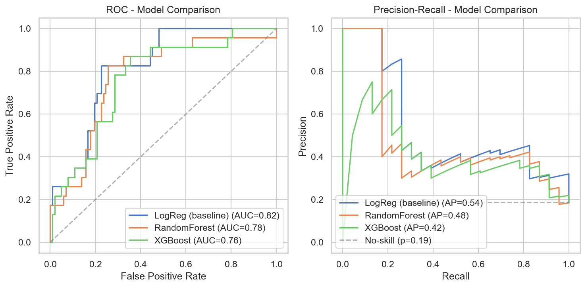
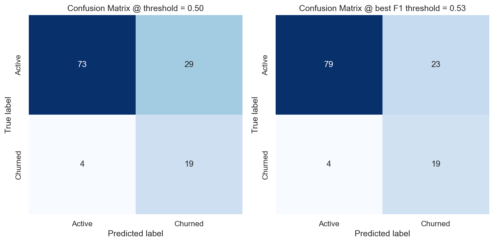

# Customer Churn Analytics

Ett end-to-end-projekt för churn-prediktion som kombinerar Python, maskininlärning och förklarbarhet. Projektet är byggt som en demo för ett verkligt grossistfall (Kalle Blomgrossist).

---

## Projektöversikt
Syftet är att identifiera kunder med hög risk att lämna och ge verksamheten möjlighet att agera proaktivt. Projektet består av:
- Notebook för analys, EDA och modellering.
- Python-moduler (`src/`) för pipeline och återanvändbar kod.
- Tester (`tests/`) för att verifiera att alla funktioner fungerar.
- Export till CSV/SQLite för integration i BI.

---

## Fördjupningar i Python

### RFM-analys
Används för att skapa churn-labels och features.
**Varför**: Standard inom marknadsföring – kopplar projektet till verklig affärslogik och ger en meningsfull definition av churn.

### Feature Engineering
Exempel: recency, 90-dagars aktivitet, säsongsandelar, AOV.
**Varför**: Kombinerar långsiktiga köpmönster med kortsiktiga trender → starkare signaler för churn-prediktion.

### Modellering
Tre modeller jämförs: Logistic Regression, Random Forest och XGBoost.
**Varför**: Ger både en tolkningsbar baseline (LogReg), en robust ensemble (RF) och en avancerad boosting-metod (XGB). XGBoost valdes då den gav bäst balans mellan AUC och F1.

### Förklarbarhet (SHAP & Feature Importance)
- SHAP används för trädmodeller.
- Permutationsbaserad feature importance används för Logistic Regression.
**Varför**: Gör det möjligt att förstå varför modellen klassar en kund som churn. Detta ökar förtroendet för modellen och underlättar affärsbeslut.

### Kalibrering av sannolikheter
Testas med isotonic och sigmoid.
**Varför**: Säkerställer att en churn-risk på exempelvis 0,8 motsvarar att kunden faktiskt churnar i cirka 80 % av fallen → mer tillförlitligt beslutsunderlag.

---

## Resultat

- XGBoost gav högst AUC och bäst balans i precision/recall.
- ROC- och PR-kurvor visar tydliga skillnader mellan modellerna.
- Confusion matrix visar effekten av olika thresholds (0,5 vs. optimal F1).
- SHAP-analys visar att recency är den starkaste prediktorn, följt av orderfrekvens och spendering.

### Exempelbilder




---

## Export till BI

Resultaten exporteras till CSV (`data/churn_predictions.csv`) och SQLite (`churn.db`). Varje kund får:
- Risk score (0–1)
- Riskband (Low, Medium, High, Critical)
- Metadata om modell, version och referensdatum

**Varför**: Gör det enkelt att koppla till Power BI för segmentering av kunder och prioritering av åtgärder.

---

## Framtida utveckling

- Automatisera pipeline med schemaläggning (Airflow, Task Scheduler).
- Direkt API-integration för orderdata (t.ex. Fortnox, Freshportal).
- Hyperparameter-tuning för XGBoost.
- Koppling till CRM (t.ex. Hubspot) för att trigga riktade kampanjer.
- Utveckla BI-rapport med drill-down och kundsegmentering.

---

## Projektstruktur

```text
customer-churn-analytics/
│
├── notebooks/               # EDA och modellering
│   └── churn_analysis.ipynb
│
├── src/                     # Pipeline-moduler
│   ├── data_prep.py
│   ├── model.py
│   ├── export.py
│   └── main.py
│
├── tests/                   # Pytest-enhetstester
│   ├── test_data_prep.py
│   ├── test_model.py
│   └── test_export.py
│
├── images/                  # Genererade figurer
│   ├── roc_pr_side_by_side.png
│   ├── cm_side_by_side.png
│   └── shap_summary.png
│
├── models/                  # Sparade modeller + metadata
│   └── final_meta.json
│
├── data/                    # Datafiler (gitignored)
│
├── requirements.txt
├── pytest.ini
├── README.md
└── .gitignore

---

## Installation och körning

Kopiera repot och installera beroenden:

    git clone https://github.com/lencemajzovska/customer-churn-analytics.git
    cd customer-churn-analytics
    pip install -r requirements.txt

### Kör pipeline

    python src/main.py

Detta gör:
1. Laddar data (API → fil → dummy fallback)
2. Rensar och förbehandlar
3. Tränar och utvärderar modeller
4. Väljer bästa modell
5. Exporterar resultat till CSV, SQLite och metadata

---

## Power BI Dashboard

Den exporterade data (CSV / SQLite) kan användas direkt i Power BI.
Dashboarden visar:

- Churn-fördelning bland kunder
- Risksegmentering (Low, Medium, High, Critical)
- Kunder med högst risk
- Modellens utvärderingsmått

*(Screenshots läggs till när dashboarden är färdigbyggd.)*

---

## Testning

Kör enhetstester med:

    pytest
