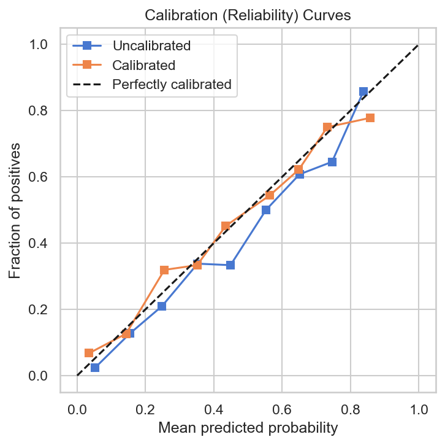

## Projektöversikt

Kundbortfall (churn) är ett vanligt affärsproblem där målet är att identifiera vilka kunder som riskerar att lämna så att retention-åtgärder kan sättas in i tid.
Sådana insatser skulle kunna vara riktade erbjudanden eller proaktiva kampanjer för att behålla fler kunder.

Detta projekt demonstrerar hur en churn-modell kan byggas och integreras i en end-to-end pipeline med automatiserad export till BI.
Syftet är att visa hur en datadriven lösning kan implementeras från inläsning av data till färdigt beslutsunderlag.

Projektet bygger på ett publikt e-handelsdataset som simulerar verklig orderhistorik.
Resultaten är därför inte generaliserbara men metodik och kodstruktur är direkt applicerbara på verkliga affärsfall.

<br>

**Arbetsflöde:**
- Datainläsning & preprocessing
- Feature engineering
- Modellträning & utvärdering
- Export av prediktioner och analysresultat
- Visualisering & analys i BI

---

## Metod

### Data och preprocessing

**Datakällor och inläsning**

Orderdata laddas i första hand via API, med fallback till CSV/XLSX. Detta gör lösningen flexibel för både demo och framtida integration.

**Rensning**

- Konverterar kolumnnamn till `snake_case` för enhetlig intern hantering
- Konverterar datumfält till datetime
- Beräknar total försäljning per rad
- Konverterar belopp till numeriskt och fyller saknade värden med 0
- Tar bort rader utan kund-id eller orderdatum
- Konverterar kund-id till heltal
- Beräknar referensdatum baserat på senaste order

<br>

**Feature engineering**

För att koppla modellen till affärslogik skapas variabler som:
- **RFM (Recency, Frequency, Monetary):** - tid sedan senaste köp, antal köp och total köpsumma
- **RFM-segmentering:** - kunder grupperas i *Loyal, Growth, Standard* och *Inactive*
- **90-dagars aktivitet:** - köp och spendering senaste 90 dagar
- **Säsongsandelar (Q1–Q4):** - andel köp per kvartal
- **Genomsnittligt ordervärde (AOV):** - beräknat på livstid och senaste 90 dagar
- **Härledda variabler:** - till exempel dagar sedan första köp, indikator för frekventa veckoköpare

Variabler som *recency* och *90-dagars aktivitet* ligger nära definitionen av churn och kan därför orsaka dataleakage.
De inkluderas initialt men tas bort innan modellträningen för att undvika att överskatta modellens prediktiva förmåga.
Detta visar vikten av att undvika dataläckage för att få realistiska resultat.

---

### Modellering

Tre modeller jämförs:
- **Logistic Regression** (baseline)
- **Random Forest**
- **XGBoost**

Samtliga tränas med **standardparametrar** utan hyperparameteroptimering.
Detta gör att jämförelsen speglar modellernas grundläggande kapacitet snarare än effekten av parameterinställningar, vilket ger en transparent och konsekvent baseline att bygga vidare på.

**Utvärdering**

Prestandan mäts med **ROC AUC** och **F1-score**, baserat på både **train/test-split (75/25)** och **5-fold cross-validation**.

---

### Förklarbarhet

För att tolka modellens beteende och förstå vilka faktorer som påverkar churn-risken mest används olika förklaringsmetoder beroende på modelltyp:

- **SHAP** används för trädmodeller (Random Forest och XGBoost).
- **Permutation importance** används för linjära modeller (Logistic Regression).

Syftet är att identifiera vilka variabler som bidrar mest till prediktionerna och koppla dem till affärslogiska mönster i kundbeteendet.Det gör modellerna mer transparenta och användbara i beslutsfattande sammanhang.

---

## Resultat

Tre modeller tränas och jämförs med **5-fold cross-validation** på träningsdatan för att hitta den mest lovande kandidaten.


| Modell             | AUC (mean) | AUC (std) | folds |
|--------------------|------------|-----------|-------|
| LogReg (baseline)  | 0.743      | 0.018     | 5     |
| RandomForest       | 0.726      | 0.017     | 5     |
| XGBoost            | 0.714      | 0.013     | 5     |

*Logistic Regression* har högst genomsnittlig AUC och mest stabil prestanda mellan folds, vilket indikerar god generaliseringsförmåga. Den väljs därför som bästa modell för vidare utvärdering på testdatan. *Random Forest* och *XGBoost* visar något lägre AUC, vilket tyder på att deras styrkor i att fånga icke-linjära samband inte utnyttjas fullt ut utan hyperparameteroptimering eller större datavolym.

---

<br>


| Modell             | AUC   | F1@0.5 | Best F1 | Best Threshold | Precision@10% |
|--------------------|-------|--------|---------|----------------|---------------|
| LogReg (baseline)  | 0.739 | 0.666  | 0.676   | 0.344          | 0.671         |

Den slutliga modellen uppnår **AUC ≈ 0.74 och F1 ≈ 0.68**, vilket indikerar en jämn avvägning mellan precision och recall. Trots att datan är simulerad presterar modellen stabilt och visar att välkonstruerade beteendevariabler kan ge hög prediktiv kraft även med en enkel baseline-modell.

---

### Visualiseringar

**Confusion matriser** visar modellens träffsäkerhet vid olika tröskelvärden. Att sänka tröskelvärdet minskar precisionen något men ökar återkallelsen (recall), vilket gör modellen bättre på att identifiera churnade kunder.
Detta är ofta önskvärt i churn-analys, där det är viktigare att upptäcka riskkunder än att undvika enstaka falska positiva.

<br>

<p align="center">

</p>

Figuren visar hur modellens klassificering förändras när tröskelvärdet sänks från **0.50** till **0.34** (bästa F1-tröskel). <br>
Antalet korrekt identifierade churnade kunder ökar från **276** till **329** men samtidigt ökar antalet aktiva kunder  som felaktigt klassas som churn (falska positiva) från **187** till **279**. <br>
Vid tröskelvärde **0.50** missas 90 churnade kunder, medan den lägre tröskeln **0.34** ger en bättre balans mellan precision och recall genom att fånga fler riskkunder. <br>

---

<br>

**ROC- och Precision–Recall kurvor** utvärderar modellens förmåga att skilja churnade från aktiva kunder.
- *ROC kurvan* visar balansen mellan träffsäkerhet (True Positive Rate) och falsklarm (False Positive Rate), medan Precision–Recall-kurvan visar sambandet mellan precision och recall, vilket är särskilt relevant vid obalanserade klasser.

<br>

<p align="center">

</p>

Figuren visar att modellen uppnår **AUC = 0.74** och **Average Precision (AP) = 0.64**, vilket betyder att den skiljer churnade kunder från aktiva på ett tillförlitligt sätt. <br>
Modellen presterar stabilt även när fler churnade kunder identifieras, vilket är viktigt i riskanalys där det är viktigare att hitta så många riskkunder som möjligt än att undvika enstaka felklassificeringar.

---

<br>

**Feature importance** identifierar vilka variabler som har störst påverkan på modellens prediktioner. För *Logistic Regression* beräknas detta med *permutation importance*, vilket mäter hur mycket modellens prestanda försämras när en enskild variabel slumpas om.

<br>

<p align="center">

</p>

Figuren visar att **recency** (antal dagar sedan senaste köp) är den mest betydelsefulla faktorn, följt av **days_since_first_purchase** och **frequency_lifetime**.
Monetära mått som **log_monetary_lifetime** och indikatorn **is_weekly_buyer** har viss påverkan, medan säsongsvariabler som **share_Q1–Q4** och **avg_order_value** har mindre betydelse.

Det innebär att kundens köphistorik och återköpsfrekvens är de tydligaste signalerna för att förutse churn, medan säsongsbeteende spelar en mer begränsad roll i detta dataset.

---

## Kalibrering

**Kalibrering** används för att justera modellens sannolikhetsskattningar så att de bättre motsvarar den faktiska churnrisken.

Modellen utvärderas först utan kalibrering (uncalibrated), och därefter med kalibrering via `CalibratedClassifierCV`. Huvudmetoden är **isotonic regression**, medan **sigmoid** fungerar som fallback om isotonic inte kan anpassas (till exempel vid för lite data).

| Modell        | AUC   | F1@0.50 | Best F1 | Best Threshold | Precision@10% |
|---------------|-------|---------|---------|----------------|---------------|
| Uncalibrated  | 0.739 | 0.666   | 0.676   | 0.344          | 0.671         |
| Calibrated    | 0.740 | 0.606   | 0.675   | 0.413          | 0.706         |

<br>

Efter kalibrering med **isotonic regression** ökar `precision @ 10 %` tydligt, vilket innebär att modellen blir bättre på att identifiera de mest riskfyllda kunderna. **AUC** förbättras marginellt men sannolikheterna blir betydligt mer tillförlitliga, en kund med 70 % beräknad risk har nu i genomsnitt en faktisk sannolikhet på 7 av 10 att lämna.

<br>

<p align="center">

</p>

Grafen visar att den kalibrerade modellen generellt följer den perfekta diagonalen bättre än den okalibrerade. Vid lägre och medelhöga sannolikheter förbättras överensstämmelsen tydligt, vilket innebär att modellen skattar churnrisk mer realistiskt. Vid de högsta sannolikheterna (över ~0.8) syns dock en viss överkalibrering – modellen tenderar att överskatta risken något.

Trots det ger isotonic-kalibreringen en stabilare och mer tillförlitlig sannolikhetsfördelning som helhet, vilket gör den mer användbar för riskbedömning. Sammanfattningsvis förbättrar kalibreringen modellens användbarhet som beslutsstöd, där sannolikheter kan tolkas som faktiska risknivåer snarare än relativa poäng.

---

## Export

Vid körning genereras filer som gör lösningen användbar för analys och integration i Power BI. Filerna sparas inte i repo utan genereras automatiskt vid körning. Strukturen visar hur en komplett pipeline kan leverera data för vidare användning.

- **Churn predictions (CSV + SQLite)**
  Risk score, riskband och metadata för varje kund.

- **Riskband summary (CSV + SQLite)**
  Sammanställning av antal kunder, medelrisk och spridning per riskband.

- **Churn over time (CSV + SQLite)**
  Månadsvis churn-rate per riskband för att analysera utveckling över tid.

- **Slutmodell (.joblib)**
  Den tränade modellen sparas för återanvändning i framtida scoring-pipelines.

- **Metadata (.json)**
  Innehåller information om träningskolumner, modellversion, beroenden och skapandedatum.


### Analys & visualisering i BI

Detta steg visar hur resultaten används i en BI-miljö för att ge insikter om kundbeteende och stöd för datadrivna beslut. Data exporteras till CSV och SQLite och kan direkt importeras i Power BI.

**Kundnivå-data**

Varje kund får:
- Risk score (0–1)
- Riskband (Low, Medium, High, Critical)
- Metadata om modell, version och referensdatum

<br>

Kunderna delas in i fyra riskband:
- **Low** (0–60%)
- **Medium** (60–85%)
- **High** (85–95%)
- **Critical** (95–100%)

<br>

**Riskbandsöversikt**

| risk_band | customers | avg_score |
|-----------|-----------|-----------|
| Low       | 2050      | 0.3413    |
| Medium    | 855       | 0.6659    |
| High      | 342       | 0.7469    |
| Critical  | 171       | 0.8016    |

Tabellen visar exempeldata med antal kunder och genomsnittlig riskpoäng per band.

**Obs:** Trösklarna är satta för demoändamål.
I verkliga tillämpningar kan gränserna justeras utifrån affärsregler, till exempel **Critical = risk > 75 %.**

<br>

**BI-visualiseringar**

Exempel på insikter som kan visualiseras i Power BI:

Churn-fördelning bland kunder
- Churn-fördelning bland kunder
- Risksegmentering (Low, Medium, High, Critical)
- Kunder med högst risk
- Modellens utvärderingsmått

<br>

Nedan visas Power BI rapport byggd på exporterad churn-data:

<h3 style="margin-left: 65px;">Översikt</h3>
<p align="center">
  
</p>

<h3 style="margin-left: 50px;">RFM-analys och riskmönster</h3>
<p align="center">
  
</p>

---

## Slutsatser & Lärdomar

Logistic Regression är en stabil och tolkbar baseline-modell som presterar väl givet datans struktur och tillgängliga features. Samtidigt kan modeller som *Random Forest* och *XGBoost* sannolikt prestera bättre på verklig data eller med mer omfattande hyperparameteroptimering, något som en linjär modell inte kan till fullo.

Analysen av feature importance visar att **recency** är den starkaste indikatorn för churn, följt av variabler som **days_since_first_purchase, frequency_lifetime** och **monetary_lifetime**. Det bekräftar att kundens köphistorik och engagemang är mer avgörande än säsongsvariationer.

**Kalibrering** av sannolikheter förbättrar modellens användbarhet snarare än dess råa prestanda. Genom isotonic-kalibrering blir sannolikheterna mer tillförlitliga, vilket gör att churnrisk kan tolkas som faktisk sannolikhet.

En annan viktig insikt är hur **dataleakage** påverkar modellutvärdering. Att exkludera variabler som ligger för nära målvariabeln, exempelvis *recency* eller *90-dagars aktivitet*, är avgörande för att få realistiska resultat.

Sammantaget visar projektet att **balansen mellan enkelhet, tolkbarhet och affärsnytta** ger störst värdei denna typ av dataset. En välkalibrerad, transparent modell kan vara mer användbar i praktiken än en mer komplex men svårtolkad modell.

---

## Framtida utveckling

Nästa steg handlar om att ta lösningen från demo till en mer produktionsnära miljö.
Följande förbättringar och tillägg kan implementeras när modellen används på verklig data:

### Automatisering & dataintegration
- Automatiserad pipeline med schemaläggning
- Direkt API-integration för orderdata

### Modellutveckling
- Hyperparameteroptimering av *Random Forest* och *XGBoost* för ökad prediktiv precision
- Kundspecifika SHAP-exempel för ökad transparens och förståelse i beslutsfattande

### AI-komponenter & affärsnytta
- LLM-komponent för att analysera kundkommentarer (till exempel sentiment eller ämnesklassning)
- Automatiserade kampanjförslag baserat på riskband och kundsegment
- Vidareutveckling av RFM-analys för att identifiera tydligare churn-trender och segmentbeteenden

### Infrastruktur
- Molnbaserad drift för att hantera större datavolymer och möjliggöra realtidsanalys

---

### Sammanfattning

Projektet demonstrerar hur en komplett pipeline kan byggas, där maskininlärning och visualisering samverkar för att ge insikter om kundbeteende. Genom att kombinera relevant datahantering, feature engineering och en kalibrerad modell skapas en lösning som inte bara förutsäger kundbortfall utan också ger direkt affärsnytta genom visualisering och beslutsstöd i Power BI. Trots att datan är simulerad visar projektet tydligt hur en praktiskt användbar modell kan implementeras och utvärderas på ett transparent sätt.

---

## Projektstruktur

```text
customer-churn-analytics/
│
├── images/
│
├── notebooks/
│   └── churn_prediction.ipynb
│
├── src/
│   ├── __init__.py
│   ├── data_prep.py
│   ├── export.py
│   ├── log_config.py
│   ├── model.py
│   └── pipeline.py
│
├── tests/
│   ├── test_data_prep.py
│   ├── test_export.py
│   └── test_model.py
│
├── .gitignore
├── README.md
├── pytest.ini
└── requirements.txt
```

Repo innehåller notebook för analys, modulär pipeline i src/, enhetstester i tests/, samt figurer för visualiseringar i README.

---

## Installation och körning

Kopiera repot och installera beroenden:

```bash
git clone https://github.com/lencemajzovska/customer-churn-analytics.git
cd customer-churn-analytics
pip install -r requirements.txt
```

Kör pipeline end-to-end:

```bash
python src/pipeline.py
```

Pipelineflöde:
1. Läser in data
2. Rensar och standardiserar datan
3. Skapar RFM-baserade features
4. Tränar och jämför modeller
5. Väljer bästa modell
5. Kalibrerar sannolikheter
6. Exporterar resultat

---

## Kodstruktur, loggning & test

Projektet är uppdelat i funktionella moduler:
- **log_config.py** - centraliserad loggkonfiguration
- **data_prep.py** - datainläsning, rensning och feature engineering
- **model.py** - modellträning, utvärdering och modellval
- **export.py** - export av riskscore, riskband och modeller
- **pipeline.py** - kör hela pipeline-flödet

### Loggning

- Färgkodad terminaloutput (renare körlogg utan tidsstämplar)
- Detaljerad loggfil sparas automatiskt i `logs/`
- Moduler loggar endast fel (`ERROR`) för att undvika brus
- Pipeline ansvarar för sammanfattande körlogg

<br>

```text
INFO    Pipeline started
INFO    Data loaded (541,909 rows, 4,372 customers)
INFO    Cleaned dataset ready (406,829 rows, 4,372 customers)
INFO    Features generated (3,376 customers, 13 features)
INFO    Train/Test split completed
INFO    LogReg (baseline) | CV AUC = 0.750 ± 0.007
INFO    RandomForest | CV AUC = 0.739 ± 0.009
INFO    XGBoost | CV AUC = 0.728 ± 0.012
INFO    Model selected: LogReg (baseline) 
INFO    Calibration applied: isotonic
INFO    Export completed
INFO    Pipeline finished successfully
```

### Testning

Testerna säkerställer att dataladdning, feature-matris och export fungerar korrekt även när källdata ändras.

Kör testerna med:

```bash
pytest
```
